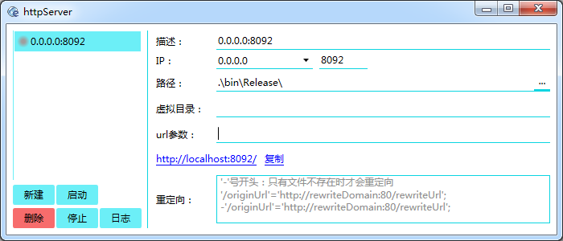

# httpServer

[https://github.com/xxxxst/httpServer](https://github.com/xxxxst/httpServer)

简易的静态http服务器，方便前端人员快速搭建一个http后端

- 小巧，单文件程序，带界面
- 不安全的
- 免配置
- 支持虚拟目录
- 支持代理
- 支持多网口运行。

---

## 环境

.net framework 4.5 or high

## 编程语言

C# | WPF

` `

---

## 依赖
- HttpMultipartParser
- WindowsAPICodePack

## license

GPL-3.0

[LICENSE.txt](./LICENSE.txt)
